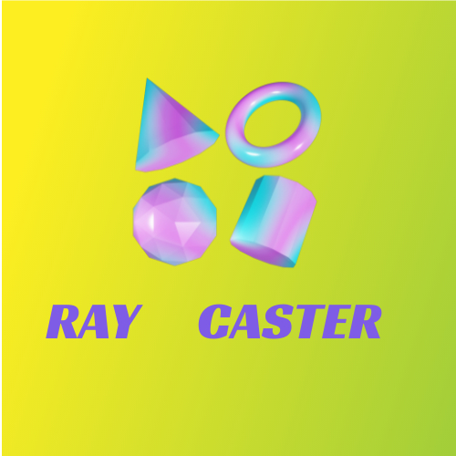
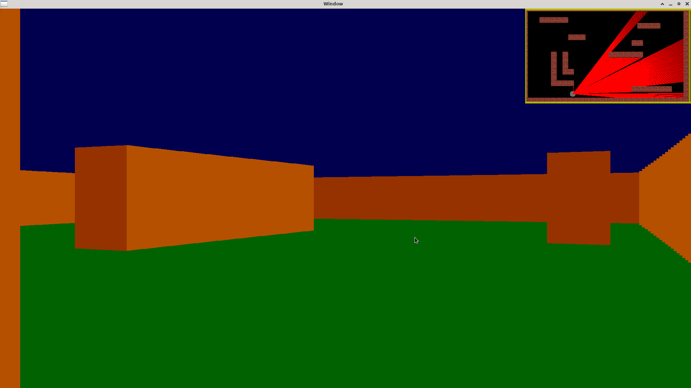

# Intro
Simple ray caster principle implementation in SFML.
Ray casting is a basic computer graphics rendering algorithms that use the geometric algorithm of ray tracing. 
Here it is :

There is a 2D map that you can see in the top left corner , rays are cast from the player, if one ray touch a wall a collum is dwaned.


# Usage and install

The makefile is at the root (need the SFML library) :
```
make 
./raycaster
```

#### Simple and Fast Multimedia Library (SFML )
`sudo apt-get install libsfml-dev`
OR
`sudo dnf install SFML-devel.x86_64`

